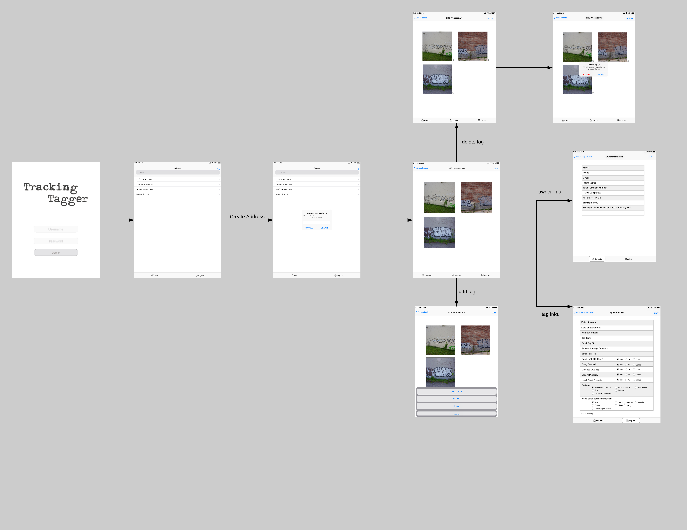

### About
This is an alternative take on the front end for the Tagging Tracker project. This app is built with ReactJS and utilizes the built in PWA feature. There is a matching [back end](https://github.com/codeforkansascity/tagging-tracker-pwa-backend) for it written in Node.

### Technical Overview
The main features of this app are:
* offline-first functionality using `Dexie` an `IndexedDB` wrapper
* basic auth with JWT
* remote sync of content
* optional storage of photos with AWS S3
* the images are turned into `base64` strings for local storage

### App overview
This is a mockup of this app, these are the current pages/built out capability

The pages/routes are generally built out as:
* navbar
* body
* bottom navbar

Where the top and bottom navbar change based on the current route.

#### App structure
The app route structure is based on the mockup above so it looks like this:
* /addresses
    * /view-address
        * /owner-info
        * /tag-info
        * /add-tag
        * /edit-tags
* /login

Initially the first route you would hit or default eg. `/` was login but it didn't make sense with the offline-first workflow.

### General notes
* the Auth token is just held in memory(state variable) so if you refresh you lose the token
    * the mobile app is not able to do pull/refresh since it's disabled by CSS
    * token expiration is 30 minutes
* `Dexie` is being used here which is a wrapper around `IndexedDB`this is a "sql-like" database in the browser so it has related tables/primary indexes/etc... this app isn't really doing anything hardcore, the relationship is:
    * addresses
        * tags
        * ownerInfo
        * tagInfo

The database is started/schema set in `App.js`

### Dev Requirements
This app is based on `create-react-app` so all you need to run it is `node`, `npm` and `npx`.
Note if you're using Ubuntu/linux you may see an issue about file system watchers, check [this link](https://github.com/facebook/jest/issues/3254#issuecomment-297214395) out
Note the `.env.example` if you're developing locally then the `REACT_APP_API_BASE_LOCAL` will probably be `localhost:5000` or whatever you choose. The remote API is only needed for login/syncing content.
`REACT_APP_BASE` is more for deployment, the purpose of this variable is for checking that the remote side where the PWA static files will be deployed is not empty/the PWA does not sync with nothing when the PWA cache is cleared.

### Installation
Clone this repo, `cd` into it and then run `npm install`
Once installed, you can run the app with `npm start`

### Deployment
Note that you can't add to homescreen from incognito. Also for iOS only Safari can add to home screen.

### Work in progress
Here is a TODO list mostly regarding cross browser styling and functionality issues as well as code cleanup/refactoring.

### More info
The original PWA/Node app was developed on this monolithic repo [here](https://github.com/jdc-cunningham/codeforkc--tagging-tracker/)

### Live PWA
[Here's a link](https://byx1a2gixtvvnjwxde5y.com/) to the live PWA current build, note the gear icon, if you click on that/hit "Software Update" that is intended to purge the PWA cache and will pull from the remote endpoint to update the code of the PWA installed on the device.